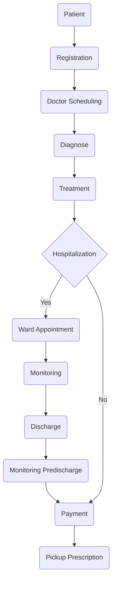

# Technical Specification Document - Hospital Information System

1. **Introduction**
   - Hospital Information System (HIS) is integrated software solution designed to optimize management of various healthcare processes within hospital or medical facility.

2. **Objective**
   - Objective of HIS to efficently manage patient information, facilitate seamless communucation between hospital staff, and ensure accurates and accesible electronic health record.

3. **Scope**
   - the scope of work for Hospital Information System (HIS) develop software for integration of patient management, electronic medical record, appointment management and finance record.

4. **Specification**
   - Front end application using next.js.
   - Back end application using Golang.

5. **Workflow Hospital Information System**

| No | Step | Details | Actor |
| :---:| :---| :--- | :---: |
|1 | Registration | Patient registry for collecting demographic data name, date of birth, gender and medical record.| Patient & Receptionist |
|2 | Doctor Scheduling | Receptionist will make schedule for doctor | Receptionist |
|3 | Diagnose | Diagnose health problem from patient| Doctor |
|4 | Treatment | Doctor do treatment from the result of diagnose | Doctor |
|5 | Hospitalization? | Doctor will determine patient needs hospitalization or not, if not patient get the prescription | Doctor |
|6 | Ward Appointment | Nurse will make appointment ward for patient | Nurse |
|7 | Monitoring | Doctor will monitor patient health | Doctor |
|8 | Discharge | Doctor will determine patient healthy or not | Doctor |
|9 | Monitoring Pre Discharge | Nurse will schedule periodic checkup after discharge | Nurse |
|10 | Payment | Payment after get billing information about ward, prescription, and diagnose fee | Doctor |
|11 | Pick up prescription | after payment patient pick up the prescription | Patient |

***

## **System Architecture**

***

### **User & Permission**

| Roles | Permission | Details |
| :--- | :--- | :---: |
| **Administrator** | User Management, System Configuration and Access Control | Create, modify, and deactivate user accounts, Assign and manage user roles, configure system settings, preferences, and defaults. Manage system integration, define and manage access control policies and assign permission to different roles. |
| Doctor | Patient records, Appointment management, Diagnose, Treatment, and Medication Management | Access and update patient demographic information, View and edit electronic health records (EHR) and clinical notes, Schedule, reschedule, and cancel patient appointments, Access own and team's appointment schedules, Enter and update diagnoses, Develop and modify treatment plans, Prescribe medications ,View and manage medication history. |
| Nurse | Patient Record, Appointment Management, Vital Signs and Measurement, and Medication Administration | Access and update patient demographic information, View and update electronic health records (EHR) and clinical notes, Schedule, reschedule, and cancel patient appointments, Access own and team's appointment schedules, Record and update vital signs and measurements, Access and update nursing notes.Record and update medication administration, View medication history. |
| Receptionist/Cashier | Patient Registration, Appointment Management, Billing and Invoicing | Register new patients and update demographic information, Verify insurance details, Schedule, reschedule, and cancel patient appointments, Access appointment schedules for providers, Generate and manage billing statements, and Verify insurance coverage. |

***

#### **Patient Registration & Data Management**

* Patient Registration Process

  **Patient Register**
    - Collecting initial information, including name, date of birth, and contack details.
    - Verifying Patient data with government id or medical record
    - Collecting demographic information and recording medical record

* Data Management
  
  **Data Accuracy**
    - System use validation check to ensure all data entered accurate and complete
    - Staff double information with the patient.

  **Data Privacy & Security**
    - Encrypted Data patient
    - Controlled access user and permisssion
    - Maintain healthcare regulation HIPAA

***

##### **Medical History & Record Management**

* Storage of medical record
  
  **Medical record are stored in centralized storage within HIS. The data is structured to allow quick access and ensured accucary. medical record are personal information, medical history, diagnoses, treatment plant, medication. data backed regularly to avoid loss and corrupt data.**

* Retrieval medical record

  **Hospital staff can retrieve medical record from secure login to the HIS. System ensure that only authorized personel have access to patient record. staff can search patient record using identifier like name, date of birth, or patient ID.**

* Updating medical record

  **Hospital staff can update patient record when there new information, only authorized staff can change information on patient record. system will track changes with timestamps and user identification to maintain audit trail. it ensure the records current change reflect on medical history patient.**

***

##### **Scheduling & Appointment Management**

* Appointment Scheduling

  **Feature appointment scheduling:**
    - Date & Time selection  : Allow staff or patient to choose preferred dates and time from available slots.
    - Doctor Selection    : Allow staff or patient to choose doctor or department healthcare.
    - Automated Confirmation : send confirmation to patient for appointment via email or SMS.

* Appointment Rescheduling

  **Features Rescheduling:**
    - Easy access        : give simple process for patient or staff to change appointment details.
    - Availability Check : display available date and time Doctor for rescheduling.
    - Automated updates  : send update appointment update and confirmation to patient and doctor.

* Appointment Cancellations

  **Feature Appointment Cancellations:**
    - Simple Process : allow patient or staff easily cancel appointment
    - Policy Enforcement : Applies cancellation policies and potential penalty fee.
    - Automated Follow Up : offer rescheduling option to patient.

* Multiple & Reccuring Appointment

  **Features Include:**
    - Batch Scheduling : Allowing staff scheduling of multiple appointment simultaneously.
    - Reccuring Pattern : Support setting up appointment on a regular basis.

***

   

